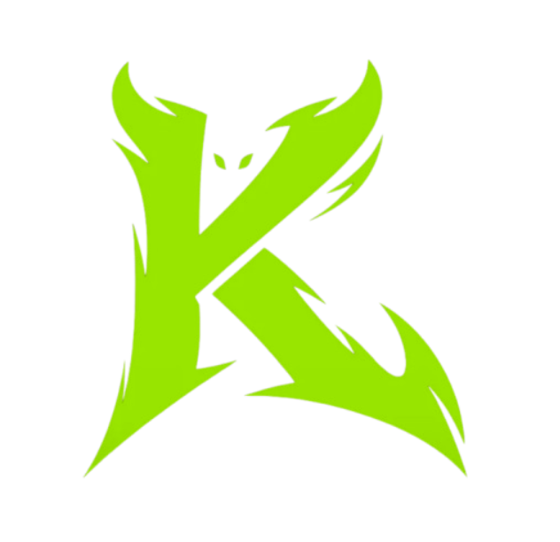

<div align="center">



# Krypt Cursor

**A free, open-source custom cursor for Windows.**

Custom cursors, motion trails, click effects and click sounds — drawn on a lightweight overlay, system-wide.

[](LICENSE)
&nbsp;[](#download)
&nbsp;[](#download)
&nbsp;[](https://discord.gg/muzFKR657F)
&nbsp;[](https://krypt.cc)

</div>

---

Krypt Cursor replaces your plain Windows pointer with a fully custom one — glow, trails, click bursts and sounds — rendered on a transparent, click-through overlay that sits above every app. Pick a preset or build your own look, tweak it live, and it applies everywhere. No account, no telemetry, just a nicer cursor.

## Download

<a href="../../releases/latest"></a>

Grab the latest installer from the [**Releases**](../../releases/latest) page, run it, and you're set. Works on Windows 10 and 11.

> The build isn't code-signed yet, so the first launch may show a SmartScreen prompt — click **More info → Run anyway**. The full source is right here if you'd rather build it yourself.

## What it does

- **Custom cursor** — built-in shapes (dot, ring, glow, crosshair, diamond, triangle, arrow, roulette) or upload your own image, then tune size, rotation, opacity, glow, spin, pulse, click-pop, smoothing, motion-echo ghosts and an outline.
- **Color modes** — solid, gradient, rainbow hue-cycle, or velocity-reactive color that shifts with mouse speed.
- **Motion trails** — comet, neon, ribbon, spark, bubbles, dots and more, with adjustable length, thickness, fade and glow.
- **Click effects** — ring, ripple, shockwave, burst, sparkle, confetti, stars, hearts, emoji and text, firing on the mouse buttons you choose.
- **Click & key sounds** — add a sound to every click (and keypress), with volume and pitch jitter; bring your own audio too.
- **Presets** — one-click looks like Krypt, Neon Pulse, Rainbow Road, Gamer, Inferno, Sakura, Stardust and Party — then save, import and export your own.
- **Live preview** — see every change in real time before it goes system-wide.

## Free and private

- Free and open source — no account, no ads, no telemetry.
- A lightweight overlay; toggle the whole thing on or off with a hotkey.
- Everything stays on your PC.

## Build from source

```powershell
npm install
npm run dev      # run in development
npm run dist     # build the installer into /release
```

Requires Node 18.18+ (20 LTS recommended) on Windows 10/11.

## Links

- **Website** — [krypt.cc](https://krypt.cc) · this tool at [krypt.cc/tools/cursor](https://krypt.cc/tools/cursor) · more free tools at [krypt.cc/tools](https://krypt.cc/tools)
- **Support and community** — [Discord](https://discord.gg/muzFKR657F)

## License

Released under the [MIT License](LICENSE) — free to use, fork and share. Please don't rebrand and resell it.

<div align="center"><sub>Built by the Krypt team · <a href="https://krypt.cc">krypt.cc</a></sub></div>
